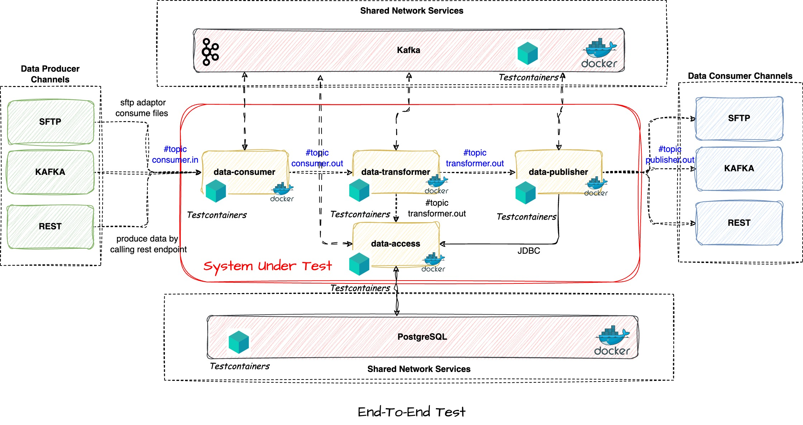

# Microservices Testing Strategies

In microservice architectural style, services are connected with each other over networks and make use of external data stores. These network
partitions affects the style of testing. In a large system multiple services work together to meet business functionalities and multiple teams are
responsible to maintain those services. In some cases asynchronous publish-subscribe communication mechanism is more useful
than synchronous point-to-point communication.   
Automated test should provide the coverage for each of these services to identify the failure points and help to 
build resilient system. With <b>continuous delivery </b> we can use a build pipeline to automatically test our application and deploy to test or production environment.

### Technical Stack
- Spring Boot
- Docker
- [Testcontainers](https://www.testcontainers.org/)
- JUnit

### Example Application
Let's consider the following example

Here we have 4 microservices which are working together to produce the end result. These services are communicating with each other in asynchronous way by subscribing & publishing through kafka topics and additionally it can persist the data to database and expose the same as and when required.

- **data-consumer** service which can consumer data from different type of data producers in different format and using different network protocols(HTTP/SFTP/TCP)
- **data-transformer** service is listening to the output of **data-consumer** service and transform the data applying some business logic
- **data-access & data-publisher** services are subscribed to the output topic of data-transformer which eventually persist the data and publish to desired format

Considering the event-driven and asynchronous integration pattern of the microservices, this is very hard to perform E2E test without the services being deployed to some test environment and connected to the network services.

### Different Approaches for microservice testing - Test Pyramid

As per Martin fowler practical [Test Pyramid](https://martinfowler.com/articles/practical-test-pyramid.html)

* ### **Unit Testing**  
    In this testing approach we normally test smallest unit of code which are written at class level or considering group of relates classes which are public.
A unit test replaces the external collaboration with test doubles(Mocking & Stubbing).
  In this example we can mock the external services by mocking the external services(kafka, postgres) and asserting the expected output of those services. 

* ### **Integration Testing**
  In microservice architecture these are used to verify interactions between layers of integration code and external components with which the services are interacting.
  In our example we can use embedded kafka or H2 in-memory database so that our services can connect those services.

* ### **End-To-End Testing(E2E)**
  An end-to-end test verifies that a system meets external requirements and achieve its goal by testing the entire system end to end. To achieve this the system under test is considered as black box and manipulate this through public interfaces.

Here we are going to concentrate mainly E2E testing approach and how this can be integrated with CI pipeline to perform the automation testing. We
still need to follow the test pyramid and write test cases for different level. 

One of the most popular approach today to perform microservices E2E test is to set up a separate test environment and run containerized applications to perform the test. This approach is having multiple problems

- We still need to use the network services, for example data stores, kafka etc which are required to be in a clean state or desired state before the execution of E2E test
- Any data manipulation by one team can affect the test execution of another team which leads to stringent test data management
- As different teams want to run their own services which is under development, it will become a costly affair to run multiple test instances with the required services

### [Testcontainers](https://www.testcontainers.org/)

We can resolve the problem of E2E testing using the Testcontainers. As per the official definition 

"_Testcontainers for Java is a Java library that supports JUnit tests, providing lightweight, throwaway instances of common databases, Selenium web browsers, or anything else that can run in a Docker container._"

There are a lot of predefined ready to use modules available from testcontainers which includes - 
- Kafka
- PostgreSQL( Other database modules such as MongoDB, MySQL module, Cassandra etc)
- Azure, GCloud 

If the predefined test contains are not available yet, we can create test containers from Generic Containers, provided the docker image is available.

#### Key Benefits
* Instead of in-memory database(H2) for DAO unit tests we can run real DB using a container to get the benefit of 100% database compatibility. In our case we can run the _PostgreSQL_ using postgres docker image and initialize the state according to out Test needs 
* As we can see on the data producer side, Kafka topic or sftp path are shared across organization and if we have to simulate the **data-consumer** service for E2E test we need publish test data to **consumer.in** topic which is not desired as other subscribers can use the same topic for their integration. We can avoid the same by using Kafka test containers.  
* As the external services dependencies are embedded with the test case itself, we can get faster feedback for e2e integration tests
* Parallel execution is easy now using isolated instances of containers 
* We can clearly define microservices version with which we want to perform E2E tests and simulate production like environment in a short-lived containerized environment 

Note: Testcontainers requires a Docker-API compatible container runtime. 

### End-To-End Microservice Testing Using TestContainers Framework

This project is an example of how to test microservices separately using docker and test containers.

#### Prerequisites
* Docker
* A supported JVM testing framework ( Jupiter/JUnit 5)

### Run End-To-End Test
Checkout the project and run the command  $ **mvn clean install**

This will build all the images for the microservices and install locally. 

### Implementing End-To-End test

This project have the following modules - 

    <modules>
        <module>data-consumer-service</module>
        <module>data-persistence-service</module>
        <module>data-publisher-service</module>
        <module>end-to-end-test</module>
        <module>data-transformer-service</module>
    </modules>

Maven Dependencies which are required to run the end-to-end test- 

        <dependency>
            <groupId>org.testcontainers</groupId>
            <artifactId>testcontainers</artifactId>
            <scope>test</scope>
        </dependency>
        <dependency>
            <groupId>org.testcontainers</groupId>
            <artifactId>junit-jupiter</artifactId>
            <scope>test</scope>
        </dependency>
        <dependency>
            <groupId>org.testcontainers</groupId>
            <artifactId>postgresql</artifactId>
            <scope>test</scope>
        </dependency>
        <dependency>
            <groupId>org.testcontainers</groupId>
            <artifactId>kafka</artifactId>
            <scope>test</scope>
        </dependency>

We can initialize the network services which are required to run the microservices. In this example we are using Kafka and PostgreSQL 

In class 

@Slf4j
public class AbstractIntegrationTest - we defined the same

    /**
     *
     * static kafka container is declared as this is required to have a single kafka setup for all the test cases.
     * 	If static is not used then each test method will get a new kafka instance
     * 	with re-use it will keep the container which is good for local development
     *
     */
    public static KafkaContainer kafkaContainer = new KafkaContainer(DockerImageName.parse("confluentinc/cp-kafka:6.2.1"))
            .withNetwork(dockerNetwork)
            .withAccessToHost(true)
            .withNetworkAliases("kafka")
            .withLogConsumer(new Slf4jLogConsumer(log).withPrefix("Kafka-Test-Container"))
            .withExposedPorts(9092, 9093)
            .withReuse(false);

    /**
     *
     * static sql container is declared as this is required to have a single database instance for all the test cases.
     * 	If static is not used then each test method will get a new database instance
     * 	with re-use it will keep the container which is good for local development
     *
     */
    public static PostgreSQLContainer postgreSQLContainer = (PostgreSQLContainer)
            new PostgreSQLContainer(PostgreSQLContainer.IMAGE)
            .withUsername("admin")
            .withPassword("admin")
            .withDatabaseName("poc_docker_container")
            .withNetwork(dockerNetwork)
            .withNetworkAliases("postgres")
            .withLogConsumer(new Slf4jLogConsumer(log).withPrefix("Postgres-Test-Container"))
            .withReuse(false); // reuse is used to keep the containers alive even after the test execution to

In the class 

public class ConsumerServiceIntegrationTest extends AbstractIntegrationTest {

we started the network services and the microservices which required to run the test and dynamically override the spring application properties by seting the environment variables - 

    @BeforeAll
    public static void  setupContainers() {
        // call
        initContainers();

        dataConsumerContainer
                .dependsOn(kafkaContainer, postgreSQLContainer)
                .withNetwork(dockerNetwork)
                .withNetworkAliases("data-consumer-service")
                .withEnv(
                        Map.of("DATABASE_URL" ,  "jdbc:postgresql://host.docker.internal:" + postgreSQLContainer.getMappedPort(5432)+ "/"+ postgreSQLContainer.getDatabaseName(),
                                "DATABASE_USER", postgreSQLContainer.getUsername(),
                                "DATABASE_PASSWORD", postgreSQLContainer.getPassword(),
                                "BOOTSTRAP_SERVER", "host.docker.internal:"+kafkaContainer.getFirstMappedPort()))
                .withExposedPorts(8080)
                .withLogConsumer(new Slf4jLogConsumer(log).withPrefix("ConsumerService"))
                .waitingFor(Wait.forLogMessage(".*Started DataConsumerService.*\\n", 1))
                .withReuse(false);

        // start SUT generic container
        log.debug("Starting data consumer service container..");
        dataConsumerContainer.start();
    }

Once all the required containers are started we can execute the E2E test by calling the following test case - 

    @Test
    public void testKafkaIntegration() {
        log.debug("Kafka address:{}", kafkaContainer.getBootstrapServers());

        KafkaTemplate kafkaTemplate = getKafkaTemplate(kafkaContainer);

        String message = "Arijit";
        kafkaTemplate.send("consumer-topic", message);

        KafkaConsumer<String, String> kafkaConsumer = getConsumer(kafkaContainer);
        kafkaConsumer.subscribe(Collections.singletonList("data-consumer-out"));

        Awaitility.await().untilAsserted(() ->  {
            ConsumerRecords<String, String> record = kafkaConsumer.poll(Duration.ofMillis(1000));
            record.forEach( rec -> {
                log.debug("Got processed : {} for input message:: {}", message, rec.value());
                Assert.assertEquals("ARIJIT", rec.value());
            });
        });
    }

On another note, we can enhance the integration test of each microservice by utilizing the testcontainers. For example, in the data-consumer-service module 

class DataConsumerServiceIntegrationTest we are dynamically overriding the spring application properties with test container property. Instead of using embedded kafka or in-memory H2 database we can replace the same with Testcontainers to perform integration 
tests similar like production environment or close to production environment. 

	@DynamicPropertySource
	public static void overrideProperty(DynamicPropertyRegistry dynamicPropertyRegistry) {
		dynamicPropertyRegistry.add("spring.datasource.url", postgreSQLContainer::getJdbcUrl);
		dynamicPropertyRegistry.add("spring.datasource.user", postgreSQLContainer::getUsername);
		dynamicPropertyRegistry.add("spring.datasource.password", postgreSQLContainer::getPassword);

		dynamicPropertyRegistry.add("spring.kafka.bootstrap-servers", kafkaContainer::getBootstrapServers);
	}

#### Additional notes

- Kafka Installation for Mac

If you want to test the application with actual kafka server locally

1. Download the latest version of Apache Kafka from https://kafka.apache.org/downloads under Binary downloads.

2. Click on any of the binary downloads (it is preferred to choose the most recent Scala version - example 2.13). For this illustration, we will assume version 2.13-3.0.0.

3. Download and extract the contents (double click in the Finder) to a directory of your choice, for example ~/kafka_2.13-3.0.0 .

4. Navigate to the root of the Apache Kafka folder and open a Terminal. Or Open a Terminal and navigate to the root directory of Apache Kafka. For this example, we will assume that the Kafka download is expanded into the ~/kafka_2.13-3.0.0 directory.

- Run Kafka
1. Start Zookeeper $ ~/kafka_2.13-3.3.1/bin/zookeeper-server-start.sh ~/kafka_2.13-3.3.1/config/zookeeper.properties
2. Start Kafka server $ ~/kafka_2.13-3.3.1/bin/kafka-server-start.sh ~/kafka_2.13-3.3.1/config/server.properties
- Or Setup the $PATH environment variable
PATH="$PATH:/Users/arijit/kafka_2.13-3.3.1/bin"
3. publish message:: kafka-console-producer.sh --broker-list localhost:9092 --topic consumer-topic
4. consume message:: kafka-console-consumer.sh --bootstrap-server localhost:9092 --topic consumer-topic --from-beginning

